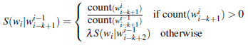
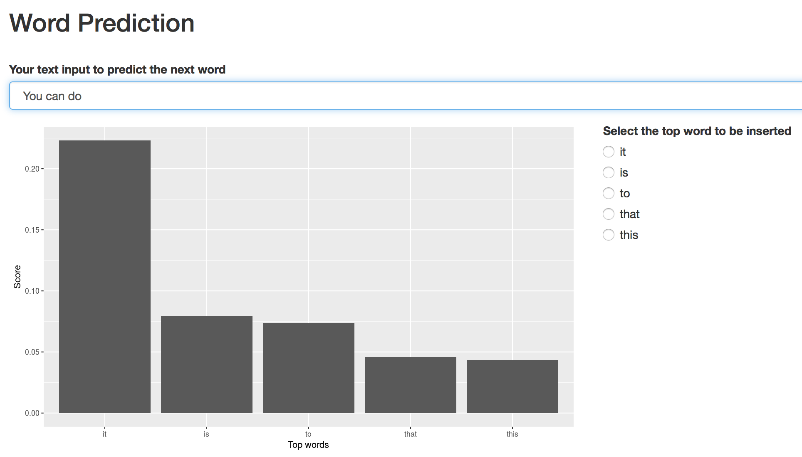

## How the model works
1. This model is built based on Coursera SwiftKey dataset. The training data are sampled about 5% of the data set, converted to lower cases, and removed unused characters. The training data are used to create unigram, bigram, trigram, and fourgram models. Each word in the models is stored using unigram hash table.
2. The stupid backoff scores are calculated. ${\alpha} = 0.4$ [1]. 
```{r, out.width = "340px", echo=FALSE, fig.align='center'}

```
The score for unigram is its word count/the number of words in unigram.
3. Shiny app lets the updated text input to the data manipulation process (step 1 and 2). The indexes are used to look up from fourgram to unigram and selected five matched top scores. Only top five scores out of 20 are displayed.

## User manual

```{r, out.width = "350px", echo=FALSE, fig.align='center'}

```

- Enter https://thammanoon.shinyapps.io/WordPrediction/ on Firefox or Safari. Please avoid using Google Chrome. 
- Wait for a few seconds to load n-gram models and top five beginning of sentence words.
- Insert words in text box or select one of the top five words
- After a few seconds, the top five words based on the sentence in the text box will be generated and shown in radio buttons. Their stupid backoff scores will be shown in the graph.

## Predictive performance
#### Test procedure
- Blogs, news, and twitter data from are randomly selected 1,000 lines per data set using linux <code>shuf</code> command.
- Each line is performed data cleaning. Its words are converted to hash indexes.
- The hash indexes before the last word are feeded to the model.
- The top five words are compared with the last word's hash index.

#### Test result (Unit: percent)
```{r, echo=FALSE}
accuracy_result_percentage <- read.table("accuracy_result_percentage.csv")
names(accuracy_result_percentage) <- c("Test set", "Best match", "Other match", "Error")

print.data.frame(accuracy_result_percentage)
```

## Novelty and references
- Reduce computation and memory by storing words using unigram hash indexes.
- Adopt stupid backoff and interpolation approach to select the best of all four n-gram models.

### Github repository of this work
https://github.com/cobu2b/coursera-datascience-capstone

### Reference
1. Brants, et al., "Large Language Models in Machine Translation", In the Proceedings of the Joint Conference on Empirical Methods in Natural Language Processing and Computational Natural Language Learning, Jun. 2007, pp. 858-867.
